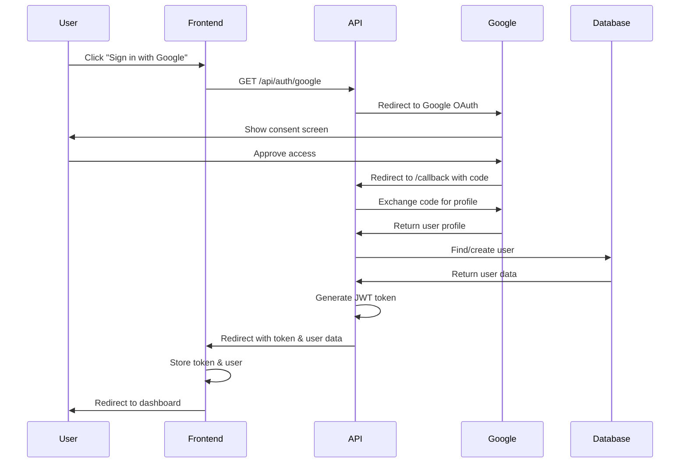

# Google OAuth Setup Guide

## Overview

This API implements Google OAuth 2.0 authentication, allowing users to sign in with their Google accounts. The implementation automatically:

- Creates new users from Google accounts
- Links Google accounts to existing email-matched users
- Auto-verifies users who sign in with Google
- Generates JWT tokens for authenticated sessions

## Configuration

### Environment Variables

The following environment variables are already configured in your `.env` file:

```env
GOOGLE_CLIENT_ID=76175019490-pj8053lob6iadhqij8o0p4tfeh420jh.apps.googleusercontent.com
GOOGLE_CLIENT_SECRET=GOCSPX-DhDzikKibvHTU1OPECNrAzszE9N
GOOGLE_CALLBACK_URL=http://digitalhealth.apiv1.wyvt.com/api/auth/google/callback
FRONTEND_URL=http://localhost:3000
```

### Google Cloud Console Setup

Your OAuth credentials are already set up. Make sure the following are configured in your [Google Cloud Console](https://console.cloud.google.com/):

1. **Authorized JavaScript Origins:**

   - `http://digitalhealth.apiv1.wyvt.com`
   - `http://localhost:5050` (for local testing)

2. **Authorized Redirect URIs:**
   - `http://digitalhealth.apiv1.wyvt.com/api/auth/google/callback`
   - `http://localhost:5050/api/auth/google/callback` (for local testing)

## API Endpoints

### 1. Initiate Google Login

**Endpoint:** `GET /api/auth/google`

**Description:** Redirects user to Google's OAuth consent screen

**Usage in Frontend:**

```javascript
// React/Next.js example
const handleGoogleLogin = () => {
  window.location.href = "http://digitalhealth.apiv1.wyvt.com/api/auth/google";
};

// HTML button
<button onClick={handleGoogleLogin}>Sign in with Google</button>;
```

### 2. Google Callback (Automatic)

**Endpoint:** `GET /api/auth/google/callback`

**Description:** Handles Google's response and redirects to frontend with JWT token

**Redirect Pattern:**

```
http://localhost:3000/auth/callback?token={JWT_TOKEN}&user={USER_JSON}
```

### 3. Logout

**Endpoint:** `GET /api/auth/logout`

**Description:** Clears user session

## Frontend Integration

### Step 1: Create Login Button

```javascript
// LoginPage.jsx
import React from "react";

const LoginPage = () => {
  const handleGoogleLogin = () => {
    window.location.href =
      "http://digitalhealth.apiv1.wyvt.com/api/auth/google";
  };

  return (
    <div>
      <h1>Login</h1>
      <button onClick={handleGoogleLogin}>Sign in with Google</button>
    </div>
  );
};

export default LoginPage;
```

### Step 2: Create Callback Handler

```javascript
// AuthCallback.jsx
import React, { useEffect } from "react";
import { useNavigate, useSearchParams } from "react-router-dom";

const AuthCallback = () => {
  const [searchParams] = useSearchParams();
  const navigate = useNavigate();

  useEffect(() => {
    const token = searchParams.get("token");
    const userString = searchParams.get("user");

    if (token && userString) {
      try {
        const user = JSON.parse(decodeURIComponent(userString));

        // Store authentication data
        localStorage.setItem("token", token);
        localStorage.setItem("user", JSON.stringify(user));

        // Redirect to dashboard
        navigate("/dashboard");
      } catch (error) {
        console.error("Authentication error:", error);
        navigate("/login?error=invalid_token");
      }
    } else {
      navigate("/login?error=no_token");
    }
  }, [searchParams, navigate]);

  return (
    <div>
      <h2>Authenticating...</h2>
      <p>Please wait while we log you in.</p>
    </div>
  );
};

export default AuthCallback;
```

### Step 3: Setup Routes

```javascript
// App.jsx
import { BrowserRouter, Routes, Route } from "react-router-dom";
import LoginPage from "./pages/LoginPage";
import AuthCallback from "./pages/AuthCallback";
import Dashboard from "./pages/Dashboard";

function App() {
  return (
    <BrowserRouter>
      <Routes>
        <Route path="/login" element={<LoginPage />} />
        <Route path="/auth/callback" element={<AuthCallback />} />
        <Route path="/dashboard" element={<Dashboard />} />
      </Routes>
    </BrowserRouter>
  );
}

export default App;
```

### Step 4: Use JWT Token for API Requests

```javascript
// api.js
const API_BASE_URL = "http://digitalhealth.apiv1.wyvt.com/api";

export const apiClient = async (endpoint, options = {}) => {
  const token = localStorage.getItem("token");

  const headers = {
    "Content-Type": "application/json",
    ...options.headers,
  };

  if (token) {
    headers["Authorization"] = `Bearer ${token}`;
  }

  const response = await fetch(`${API_BASE_URL}${endpoint}`, {
    ...options,
    headers,
  });

  return response.json();
};

// Usage example
export const getUserProfile = () => {
  return apiClient("/users/profile");
};

export const createMealPlan = (data) => {
  return apiClient("/meal-planner/generate", {
    method: "POST",
    body: JSON.stringify(data),
  });
};
```

## Authentication Flow



## User Data Structure

When a user authenticates with Google, the following data is returned:

```json
{
  "id": "cm3vwx123abc456def789",
  "firstName": "John",
  "lastName": "Doe",
  "email": "john.doe@gmail.com",
  "role": "user",
  "isVerified": true
}
```

**Database Fields:**

- `googleId`: Stored in database for future Google logins
- `isVerified`: Automatically set to `true` for Google users
- `password`: Set to `null` for Google OAuth users

## Error Handling

### Frontend Error Handling

```javascript
// AuthCallback.jsx with error handling
const AuthCallback = () => {
  const [searchParams] = useSearchParams();
  const navigate = useNavigate();

  useEffect(() => {
    const error = searchParams.get("error");

    if (error) {
      // Handle authentication errors
      const errorMessages = {
        authentication_failed:
          "Google authentication failed. Please try again.",
        server_error: "Server error occurred. Please try again later.",
      };

      alert(errorMessages[error] || "An unknown error occurred.");
      navigate("/login");
      return;
    }

    // ... rest of the code
  }, [searchParams, navigate]);
};
```

### Common Error Scenarios

1. **Invalid Credentials:**

   - Redirects to: `{FRONTEND_URL}/login?error=authentication_failed`

2. **Server Error:**

   - Redirects to: `{FRONTEND_URL}/login?error=server_error`

3. **User Denies Access:**
   - Google redirects back with error parameter

## Testing

### Local Testing

1. Start your backend:

   ```bash
   npm run dev
   ```

2. Update your Google OAuth settings to include:

   - Origin: `http://localhost:5050`
   - Redirect URI: `http://localhost:5050/api/auth/google/callback`

3. Update `.env` temporarily:

   ```env
   GOOGLE_CALLBACK_URL=http://localhost:5050/api/auth/google/callback
   ```

4. Test the flow:
   - Visit: `http://localhost:5050/api/auth/google`
   - Sign in with Google
   - Should redirect to your frontend with token

### Production Testing

1. Ensure all environment variables are set correctly
2. Verify OAuth redirect URIs in Google Cloud Console
3. Test complete authentication flow
4. Verify JWT token works for protected endpoints

## Security Considerations

1. **HTTPS Required in Production:**

   - Google OAuth requires HTTPS in production
   - Update callback URL to use `https://`

2. **Token Storage:**

   - Store JWT in `httpOnly` cookies for better security
   - Or use secure localStorage with XSS protection

3. **CORS Configuration:**

   - Ensure your frontend domain is allowed in CORS settings
   - Currently set to allow all origins (update for production)

4. **JWT Secret:**
   - Change `JWT_SECRET` in production to a strong random value
   - Never commit secrets to version control

## Troubleshooting

### Issue: "Redirect URI Mismatch"

**Solution:** Ensure the exact callback URL in `.env` matches the one in Google Cloud Console.

### Issue: "Invalid Client ID"

**Solution:** Verify `GOOGLE_CLIENT_ID` and `GOOGLE_CLIENT_SECRET` are correct.

### Issue: User Not Redirected to Frontend

**Solution:** Check `FRONTEND_URL` is correctly set in `.env`.

### Issue: Token Not Working

**Solution:** Verify `JWT_SECRET` is the same across all environments.

## Additional Features

### Linking Existing Accounts

If a user registers with email/password and later uses Google OAuth with the same email:

- The Google account is automatically linked to the existing user
- User can sign in with either method
- `googleId` is added to the user's profile

### Multiple OAuth Providers

To add more OAuth providers (Facebook, GitHub, etc.):

1. Install the passport strategy: `pnpm add passport-facebook`
2. Add credentials to `.env`
3. Configure strategy in `src/config/passport.ts`
4. Add routes in `src/routes/auth.routes.ts`

## Support

For issues or questions:

- Email: DigitalHealthAssistance@gmx.com
- Documentation: `/API_DOCUMENTATION.md`

---

**Last Updated:** November 25, 2025
